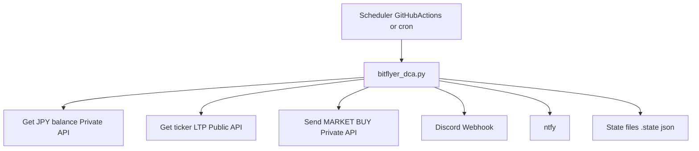
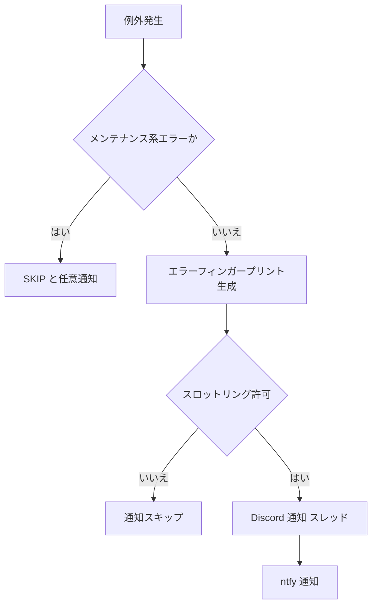

# bitflyer-dcaアーキテクチャ設計書

## 概要

本ドキュメントは **bitflyer-dca** のシステム構成および処理フローを説明します。
GitHub Actions や cron から定期実行され、bitFlyer Lightning API を用いて
BTC/JPY の自動積立（DCA）を行います。

---

## システム構成図

---

## 通常処理フロー

1. Scheduler（GitHub Actions / cron）が `bitflyer_dca.py` を起動
2. 環境変数を読み込み、必須設定を検証
3. SKIP 判定
   - JST 時刻レンジ SKIP
   - API メンテナンス判定（502/503/504）
4. 利用可能な JPY 残高を取得（Private API）
5. BTC/JPY の LTP を取得（Public API）
6. 購入 BTC 数量を計算
7. 最小注文数量をチェック
8. 成行 BUY 注文を発行
9. 成功状態を `.state` に保存
10. Discord / ntfy へ成功通知を送信

---

## エラー処理フロー

---

## 状態管理

### 管理ファイル

- `.state/alert_state.json`
  - エラーフィンガープリントと最終通知時刻
- `.state/success_state.json`
  - 累積約定 BTC 数
  - 累積約定 JPY 金額
  - 約定回数

### 目的

- 同一エラーの通知多発を防止
- 長期運用時の累積実績を保持

---

## 通知設計

### Discord

- Webhook による投稿
- 親メッセージに要約を投稿
- スレッド内にスタックトレース詳細を投稿
- メッセージリンクを生成可能

### ntfy

- 軽量 Push 通知
- スタックトレースなしの要約通知
- タップで Discord メッセージへ遷移

---

## セキュリティ方針

- API キーは出金権限なし
- 秘密情報は環境変数でのみ管理
- ログや通知に署名・トークンを出力しない

---

## 運用ポリシー

- 初回は必ず `DRY_RUN=true` で動作確認
- `MAX_BUY_AMOUNT_JPY` を必ず設定
- 通知スロットリングを有効化
- `.state` ディレクトリを定期的に確認
